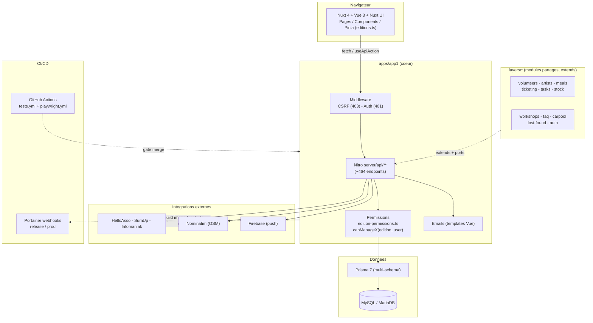

# Analyse du codebase — Convention de Jonglerie

> Généré le 2026-07-25. Application web full-stack de gestion et de découverte de conventions de jonglerie.
> Monorepo Nuxt 4 · TypeScript · Prisma/MySQL · architecture en _layers_ Nuxt partagés.

## Sommaire

1. [Vue d'ensemble du projet](#1-vue-densemble-du-projet)
2. [Structure des répertoires](#2-structure-des-répertoires)
3. [Découpage fichier par fichier](#3-découpage-fichier-par-fichier)
4. [Analyse des endpoints API](#4-analyse-des-endpoints-api)
5. [Architecture en profondeur](#5-architecture-en-profondeur)
6. [Environnement & mise en place](#6-environnement--mise-en-place)
7. [Stack technologique](#7-stack-technologique)
8. [Diagramme d'architecture](#8-diagramme-darchitecture)
9. [Constats & recommandations](#9-constats--recommandations)

---

## 1. Vue d'ensemble du projet

| Dimension        | Détail                                                                                          |
| ---------------- | ----------------------------------------------------------------------------------------------- |
| **Type**         | Application web full-stack (SSR/universelle) + API REST intégrée                                 |
| **Domaine**      | Gestion & découverte de conventions de jonglerie (conventions → éditions → modules)             |
| **Frontend**     | Nuxt 4 (Vue 3), Nuxt UI 4 (Tailwind), Pinia, @nuxtjs/i18n (13 langues, lazy loading par domaine) |
| **Backend**      | Nitro (moteur serveur de Nuxt), API REST par ressource                                           |
| **Base de données** | MySQL / MariaDB via Prisma 7 (ORM), schéma multi-fichiers par domaine                         |
| **Langage**      | TypeScript 5                                                                                      |
| **Auth**         | Sessions scellées par cookie (`nuxt-auth-utils`) + bcryptjs                                       |
| **Tests**        | Vitest (unit + Nuxt) & Playwright (e2e)                                                           |
| **Architecture** | **Monorepo** : `apps/app1` (app principale) + `apps/app2` (placeholder) + `layers/*` partagés     |
| **Déploiement**  | Docker (contexte racine) → stacks Portainer (release / prod) via webhooks                         |

**Pattern architectural** : modulaire par _feature layers_ Nuxt. Chaque module métier optionnel
(bénévoles, billetterie, ateliers…) est un **layer Nuxt autonome** sous `layers/`, consommé par
`apps/app1` via `extends`. Le cœur applicatif (auth, conventions, éditions, permissions, i18n,
notifications) vit dans `apps/app1`. Pas de rôles : le contrôle d'accès repose sur des **droits
granulaires** par organisateur.

---

## 2. Structure des répertoires

```
convention-de-jonglerie/
├── apps/
│   ├── app1/                  # Application jonglerie (cœur historique)
│   │   ├── app/               # Frontend Nuxt (components, pages, stores, composables, middleware, layouts, types)
│   │   ├── server/            # Backend Nitro (api/, utils/, middleware/, constants/, emails/)
│   │   ├── prisma/            # Schéma multi-fichiers (schema/*.prisma) + migrations/ (34)
│   │   ├── i18n/locales/      # 13 langues × ~24 domaines JSON (lazy loading par route)
│   │   ├── test/              # Vitest unit/nuxt/integration + Playwright e2e
│   │   ├── scripts/           # Géocodage, admin, traduction i18n, favicons…
│   │   └── docker-compose.*.yml, Dockerfile
│   └── app2/                  # 2ᵉ app autonome (placeholder, ~6 pages, prisma généré propre)
├── layers/                    # 11 layers Nuxt PARTAGÉS (extends depuis apps/app1)
│   ├── auth/  volunteers/  artists/  meals/  ticketing/  tasks/
│   ├── faq/   workshops/   stock/   carpool/  lost-found/
├── docs/                      # Documentation technique (français) — docs/README.md = index
├── .github/workflows/         # CI : tests.yml (lint/typecheck/unit/nuxt/db/e2e/build) + playwright.yml
├── .claude/skills/            # Skills projet (full-pipeline, deploy, code-review, i18n-fix…)
├── package.json               # Proxy racine : scripts app1:* / app2:*
└── CLAUDE.md                  # Conventions pour assistants IA
```

**Rôles clés :**

- **`apps/app1/app/`** — Frontend : `components/` (PascalCase, sous-dossiers par domaine), `pages/`
  (routing fichier, y compris `editions/[id]/gestion/*` pour le back-office), `stores/` (Pinia — dont
  `editions.ts` qui porte les helpers de permissions **côté client**), `composables/` (ex.
  `useApiAction` standardisé), `middleware/` (`auth-protected`, `guest-only`, `super-admin`…),
  `layouts/` (dont `edition-dashboard.vue` = menu latéral de gestion), `types/`.
- **`apps/app1/server/`** — Backend : `api/` (endpoints REST par ressource), `utils/` (helpers dont
  `permissions/edition-permissions.ts`, `prisma-select-helpers.ts`, `organizer-management.ts`),
  `middleware/` (CSRF `00.csrf.ts`, auth), `constants/permissions.ts`, `emails/` (templates Vue).
- **`layers/<module>/`** — Chaque layer réplique la structure `app/` + `server/api/` pour son module,
  et communique avec le cœur via des **ports** (`#server/<module>/ports/registry`) pour ne pas
  dépendre directement du modèle `Edition`.
- **`apps/app1/prisma/schema/`** — 13 fichiers : `schema.prisma` (User, Convention, Edition,
  organisateurs & permissions) + un fichier par domaine (`artists`, `carpool`, `faq`, `meals`,
  `messenger`, `misc`, `project-costs`, `stock`, `tasks`, `ticketing`, `volunteer`, `workshops`).

---

## 3. Découpage fichier par fichier

### Core application

- **`apps/app1/app/stores/editions.ts`** — Store Pinia central. Porte les getters/actions d'éditions
  **et** les helpers de permissions côté client (`canEditEdition`, `canManageArtists`, `canManageMeals`,
  `canManageTicketing`, `canManageWorkshops`, `canManageFAQ`, `isOrganizer`…), miroirs des helpers
  serveur.
- **`apps/app1/server/utils/permissions/edition-permissions.ts`** — **Cœur du contrôle d'accès**.
  `getEditionWithPermissions()` (charge Edition + organisateurs + permissions per-édition) et les
  fonctions `canX(edition, user)`. Type `EditionWithPermissions`.
- **`apps/app1/server/utils/organizer-management.ts`** — CRUD des organisateurs et de leurs droits
  (convention + per-édition), snapshots d'historique.
- **`apps/app1/server/constants/permissions.ts`** — Source de vérité des droits (`ORGANIZER_RIGHTS`,
  `RESOURCE_RIGHTS`, helpers `createEmptyPermissions`…).
- **`apps/app1/app/layouts/edition-dashboard.vue`** — Menu de gestion d'une édition ; chaque entrée
  est conditionnée par le flag `*Enabled` **et** le droit correspondant.
- **`apps/app1/app/components/organizer/RightsFields.vue`** — UI d'attribution des droits (tableau
  global + par édition, un switch par droit/section).

### Configuration

- **`package.json`** (racine) — proxy de scripts préfixés `app1:*` / `app2:*` (fonctionne **sans
  arguments** ; avec arguments, lancer depuis `apps/app1`).
- **`apps/app1/nuxt.config.ts`** — `extends: ['../../layers/*']`, auto-imports (dont
  `getUserSession` depuis `nuxt-auth-utils`), config i18n/Prisma.
- **`apps/app1/vitest.config.ts`** — projets `unit` et `nuxt` séparés.
- **Config Prettier** — clé `prettier` dans `apps/app1/package.json` (`singleQuote`, `semi:false`,
  `printWidth:100`, `trailingComma:es5`). ⚠️ Un fichier sous `layers/` n'hérite pas de ce config
  automatiquement (résolution depuis la racine).

### Data layer

- **`apps/app1/prisma/schema/*.prisma`** — schéma découpé par domaine.
- **`apps/app1/prisma/migrations/`** — 34 migrations versionnées (dernières : `add_can_manage_workshops`,
  `add_can_manage_faq`).
- **`apps/app1/server/utils/prisma-select-helpers.ts`** — sélections/includes standardisés
  (`userBasicSelect`, `editionListInclude`…) à réutiliser plutôt que dupliquer.

### Frontend / UI

- **Nuxt UI 4** exclusivement pour les composants courants ; **Nuxt Icon** pour les icônes ;
  **Tailwind** pour le style. Composables : `useApiAction` / `useApiActionById` standardisent les
  appels API (loading, toasts, redirections).

### Testing

- **`test/unit/`** (Vitest, host OK) · **`test/nuxt/`** (Vitest environnement Nuxt — ⚠️ à lancer
  **dans le conteneur**, cf. §6) · **`test/integration/*.db.test.ts`** (base réelle) ·
  **`test/e2e/playwright/`** (e2e).

### Documentation / DevOps

- **`docs/`** — documentation technique en français (index `docs/README.md`).
- **`.github/workflows/tests.yml`** — CI matricielle (lint, typecheck, unit, nuxt, db, e2e, build),
  cache `.nuxt` par clé. **`playwright.yml`** — e2e en `workflow_dispatch` (manuel par branche).

---

## 4. Analyse des endpoints API

- **~464 fichiers d'endpoints** (`apps/app1/server/api` + `layers/*/server/api`), organisés par
  ressource, nommés par convention Nitro : `index.get.ts`, `[id].put.ts`, `reorder.put.ts`…
- **Auth** : middleware serveur → `401` pour tout `/api/**` non listé dans `public-routes.ts` ;
  middleware CSRF (`00.csrf.ts`) → `403`. Les handlers utilisent `requireAuth` / `optionalAuth`.
- **Autorisation** : chaque endpoint de gestion charge l'édition via `getEditionWithPermissions`
  puis appelle le helper `canX(edition, user)` adéquat.
- **Endpoints d'organisateurs (extraits)** :
  - `POST /api/conventions/:id/organizers` — `{ userIdentifier|userId, rights?, title?, perEdition? }`
  - `PUT|PATCH /api/conventions/:id/organizers/:organizerId` — `{ rights?, title?, perEdition? }`
  - `GET /api/editions/:id` et `GET /api/conventions/:id/organizers` — exposent `rights` (clés courtes
    `manageX`) + `perEditionRights` (clés `canManageX`).
- **Ports par layer** — les endpoints d'un layer passent par un registre de ports
  (`useFaqPorts()`, `useWorkshopsPorts()`…) pour lire la config/visibilité d'un module sans coupler
  le layer au modèle `Edition`.

---

## 5. Architecture en profondeur

### Modèle de permissions (pièce maîtresse)

Pas de rôles — des **droits granulaires** à deux niveaux :

- **`ConventionOrganizer.canManage*`** — droit au niveau **convention** (toutes éditions).
- **`EditionOrganizerPermission.canManage*`** — droit **per-édition**, rattaché à un
  `ConventionOrganizer`.

Un organisateur gère une section si **(a)** droit convention **ou (b)** droit per-édition. Court-circuits :
**super-admin** (`User.isGlobalAdmin` en mode admin), **auteur de convention**, **créateur d'édition**.

**Principe directeur (récemment consolidé)** : _éditer une édition (`canEdit`) ne donne accès qu'à la
partie « Informations »_. Chaque section métier exige son **droit dédié** :

| Module        | Flag              | Droit dédié            | Route gestion                       |
| ------------- | ----------------- | ---------------------- | ----------------------------------- |
| Bénévoles     | `volunteersEnabled` | `canManageVolunteers`  | `/editions/[id]/gestion/volunteers` |
| Artistes      | `artistsEnabled`  | `canManageArtists`     | `/editions/[id]/gestion/artists`    |
| Repas         | `mealsEnabled`    | `canManageMeals`       | `/editions/[id]/gestion/meals`      |
| Billetterie   | `ticketingEnabled`| `canManageTicketing`   | `/editions/[id]/gestion/ticketing`  |
| Tâches        | `tasksEnabled`    | `canManageTasks`       | `/editions/[id]/gestion/tasks`      |
| Stock         | `stockEnabled`    | `canManageStock`       | `/editions/[id]/gestion/stock`      |
| **Workshops** | `workshopsEnabled`| **`canManageWorkshops`** _(dédié — PR #79)_ | `/editions/[id]/gestion/workshops` |
| **FAQ**       | `faqEnabled`      | **`canManageFAQ`** _(dédié — PR #80)_ | `/editions/[id]/gestion/faq`        |
| Carte du site | `siteMapEnabled`  | `canEditAllEditions` / `canEdit` | via fiche édition          |
| Objets trouvés| _toujours actif_  | `canEditAllEditions` / `canEdit` | via fiche édition          |

> ℹ️ `canManageWorkshops` et `canManageFAQ` sont des droits dédiés (colonnes DB + UI + i18n),
> désormais reflétés dans la matrice du `README.md` (mise à jour le 2026-07-25).

Cohérence **client ↔ serveur** : chaque `canX` serveur (`server/utils/permissions/edition-permissions.ts`)
a un miroir dans le store client (`app/stores/editions.ts`). Un désalignement (client plus permissif
que serveur) est précisément le type de bug corrigé lors du refactor permissions.

### Cycle de vie d'une requête de gestion

```
Requête → middleware CSRF (403 si KO) → middleware auth (401 si /api hors public-routes)
        → handler : requireAuth → getEditionWithPermissions(editionId, {userId})
        → canManageX(edition, user) ? 403 : accès → Prisma → réponse
```

### Layers & ports

Chaque module optionnel est un **layer autonome** (`layers/<module>`) : son frontend et ses endpoints
sont fusionnés dans app1 via `extends`. Pour éviter le couplage au cœur, un layer lit la config/visibilité
d'un module via un **port** (registre injecté), pas directement `Edition`.

---

## 6. Environnement & mise en place

### Variables d'environnement clés

`DATABASE_URL`, `NUXT_SESSION_PASSWORD` (32+ chars), `SEND_EMAILS` (+ `SMTP_USER`/`SMTP_PASS`),
variables MySQL Docker, `PRISMA_LOG_LEVEL`, `PORTAINER_RELEASE_WEBHOOK_URL` / `PORTAINER_PROD_WEBHOOK_URL`
(déploiement, secrets — dans `apps/app1/.env`).

### Workflow de développement

- Environnement dev via **Docker** (`npm run app1:docker:dev:detached`) ; app sur `http://localhost:3000`.
- **Migrations** : `npx prisma migrate dev` (crée + applique + régénère le client).
- **i18n** : ne modifier que le FR de sa propre initiative ; `check-i18n` / `check-translations`
  synchronisent les autres langues en `[TODO]`, `translate-todos` les traduit.
- **Qualité** : `/full-pipeline` enchaîne i18n-fix → translate-todos → code-review → quality-check
  (lint-fix → tests → commit-push).

> ⚠️ **Piège local connu** : le dossier `.nuxt` est bind-monté depuis le conteneur dev (owned root,
> mode-dev). Sur le **host**, `nuxt typecheck` et les **tests Nuxt** échouent faussement
> (`getUserSession is not a function`, erreurs `tsconfig` composite/emit). **Lancer typecheck et
> tests Nuxt DANS le conteneur** (`docker compose exec app …`) ; la **CI** (qui génère `.nuxt`
> proprement via `nuxt prepare`) fait foi. Les tests **unitaires** passent sur le host.

### Déploiement

Images Docker construites avec la **racine du repo** comme contexte (layout `/app/apps/app1` +
`/app/layers` reproduit). Redéploiement via **webhooks Portainer** (release / prod) qui re-pull les
images et recréent les conteneurs.

---

## 7. Stack technologique

| Couche             | Technologies                                                                    |
| ------------------ | ------------------------------------------------------------------------------- |
| **Runtime**        | Node.js, Nitro (serveur Nuxt)                                                    |
| **Frontend**       | Nuxt 4 · Vue 3 · Nuxt UI 4 (Tailwind) · Pinia · VueUse · @nuxtjs/i18n · Nuxt Icon/Image |
| **Viz / UI**       | Chart.js · FullCalendar · Leaflet · Nuxt QRCode                                  |
| **Backend / ORM**  | Nitro · Prisma 7 (`@prisma/adapter-mariadb`)                                     |
| **Base de données**| MySQL 8 / MariaDB (+ shadow DB pour migrations)                                  |
| **Auth / sécurité**| nuxt-auth-utils (sessions cookie scellées) · bcryptjs · middleware CSRF          |
| **Tests**          | Vitest (unit + nuxt) · Playwright (e2e) · @nuxt/test-utils                        |
| **Outillage**      | ESLint 9 · Prettier · TypeScript 5                                                |
| **Intégrations**   | HelloAsso / SumUp / Infomaniak (billetterie) · Firebase (push) · Nominatim (géocodage) · SSE (messagerie temps réel) |
| **DevOps**         | Docker / docker-compose · GitHub Actions · Portainer (webhooks)                  |

---

## 8. Diagramme d'architecture



**Flux de données (gestion d'un module)** :
`Vue (store canManageX) → $fetch → CSRF/Auth → handler → getEditionWithPermissions → canManageX → Prisma → MySQL → réponse → toast`.

---

## 9. Constats & recommandations

### Points forts

- **Séparation modulaire nette** via layers Nuxt + ports → chaque module métier est isolé et testable.
- **Modèle de permissions cohérent et symétrique** client/serveur, avec principe clair
  « éditer ≠ gérer une section » désormais appliqué uniformément (dont workshops & FAQ).
- **Outillage i18n mûr** (13 langues, lazy loading par domaine, scripts de synchronisation/traduction).
- **Couverture de tests élevée** (unit + nuxt + integration DB + e2e Playwright) et **CI complète**
  bloquant le merge.
- **Helpers standardisés** (`prisma-select-helpers`, `useApiAction`) qui réduisent la duplication.

### Améliorations suggérées

- **Documentation** : matrice de permissions et compte de langues du `README.md` mis à jour le
  2026-07-25 (Workshops/FAQ droits dédiés · 13 langues). Penser à répercuter tout nouveau droit
  dédié dans les deux tableaux du README.
- **DX locale** : le piège `.nuxt` host/conteneur (typecheck & tests Nuxt) gagnerait à être documenté
  dans le README/`docs/` et/ou automatisé (script qui route ces commandes vers le conteneur).
- **Stabilité conteneur dev** : crashs OOM récurrents (`Exited 137`) lors de builds/typechecks
  concurrents → envisager d'augmenter la mémoire allouée ou d'isoler les runs lourds.
- **Cohérence des défauts d'UI** : certains blocs de droits par défaut (`organizers.vue`) n'énumèrent
  qu'un sous-ensemble des `manage*` (le composant complète les clés manquantes, mais l'incohérence
  invite à centraliser la liste des droits).
- **Sécurité** : le modèle (CSRF + public-routes explicites + permissions par endpoint) est solide ;
  veiller à ce que **tout nouvel endpoint public** soit bien ajouté à `public-routes.ts` (un test
  unitaire de handler ne l'attrape pas — il bypasse le middleware).

### Considérations de performance

- Le lazy loading i18n par route et les `select`/`include` Prisma standardisés limitent la charge.
- Surveiller la taille des `include` de permissions sur les endpoints très sollicités (chaque
  vérification recharge organisateurs + permissions per-édition).

---

_Analyse générée automatiquement (skill `/analyze-codebase`). Le code reste la source de vérité en cas
d'écart avec la documentation._
