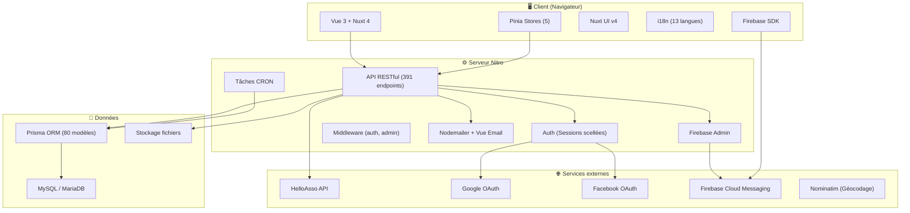
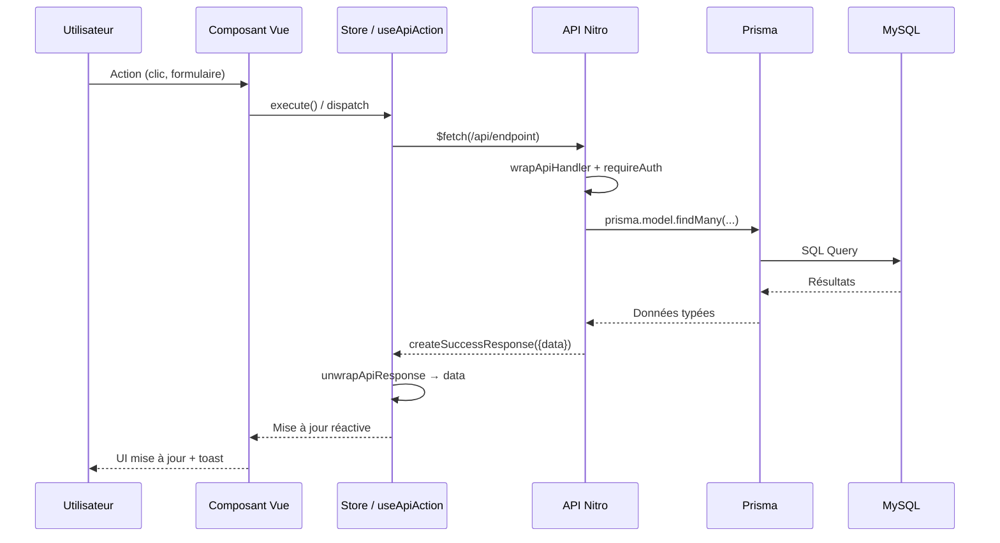

# Analyse complète du Codebase — Convention de Jonglerie

> **Dernière mise à jour** : 27 mars 2026
> **Taille du projet** : ~165 Mo | ~2 884 fichiers de code
> **Version Node.js** : >=22 <26

## Table des matières

- [1. Vue d'ensemble du projet](#1-vue-densemble-du-projet)
- [2. Stack technique](#2-stack-technique)
- [3. Statistiques du codebase](#3-statistiques-du-codebase)
- [4. Architecture du projet](#4-architecture-du-projet)
- [5. Structure des répertoires](#5-structure-des-répertoires)
- [6. Couche données (Prisma)](#6-couche-données-prisma)
- [7. API Backend](#7-api-backend)
- [8. Frontend](#8-frontend)
- [9. Internationalisation](#9-internationalisation)
- [10. Tests](#10-tests)
- [11. DevOps et déploiement](#11-devops-et-déploiement)
- [12. Diagramme d'architecture](#12-diagramme-darchitecture)
- [13. Insights et recommandations](#13-insights-et-recommandations)

---

## 1. Vue d'ensemble du projet

**Type** : Application web full-stack (SSR + SPA)

**Objectif** : Plateforme de gestion et découverte de conventions de jonglerie. Permet aux utilisateurs de consulter, créer et gérer des conventions, avec des modules avancés : bénévolat, billetterie, messagerie, covoiturage, artistes/spectacles, repas, objets trouvés, ateliers et cartographie.

**Architecture** : Monolithe full-stack avec Nuxt 4 (frontend Vue 3 + backend Nitro), API RESTful, base de données MySQL via Prisma ORM.

---

## 2. Stack technique

| Catégorie      | Technologie                | Version |
| -------------- | -------------------------- | ------- |
| **Framework**  | Nuxt.js                    | 4.4.2   |
| **Frontend**   | Vue.js                     | 3.5.17  |
| **UI**         | Nuxt UI                    | 4.5.1   |
| **État**       | Pinia                      | 3.0.4   |
| **Langage**    | TypeScript                 | 5.9.3   |
| **ORM**        | Prisma                     | 7.5.0   |
| **BDD**        | MySQL/MariaDB              | -       |
| **Auth**       | nuxt-auth-utils            | 0.5.29  |
| **i18n**       | @nuxtjs/i18n               | 10.2.3  |
| **CSS**        | Tailwind CSS (via Nuxt UI) | -       |
| **Tests**      | Vitest                     | 4.1.0   |
| **Calendrier** | FullCalendar               | 6.1.20  |
| **Charts**     | Chart.js + vue-chartjs     | 4.5.1   |
| **Email**      | Nodemailer + Vue Email     | -       |
| **Push**       | Firebase Cloud Messaging   | 12.9.0  |
| **QR Code**    | nuxt-qrcode + html5-qrcode | -       |
| **PDF**        | jsPDF + jspdf-autotable    | -       |
| **SEO**        | @nuxtjs/seo                | 3.4.0   |
| **Linter**     | ESLint                     | 10.0.3  |
| **Format**     | Prettier                   | 3.8.1   |

---

## 3. Statistiques du codebase

| Métrique            | Valeur               |
| ------------------- | -------------------- |
| Fichiers de code    | ~2 884               |
| Composants Vue      | 144                  |
| Pages               | 99                   |
| Endpoints API       | 391                  |
| Modèles Prisma      | 80                   |
| Migrations          | 157                  |
| Clés i18n           | 3 525                |
| Langues supportées  | 13                   |
| Tests unitaires     | 367 (18 fichiers)    |
| Tests Nuxt          | 1 605 (161 fichiers) |
| Tests d'intégration | 7 fichiers           |
| Stores Pinia        | 5                    |
| Composables         | 48                   |
| Layouts             | 4                    |
| Middleware client   | 6                    |
| Middleware serveur  | 3                    |
| Plugins             | 7                    |
| Scripts utilitaires | 29                   |
| Docker compose      | 9                    |

---

## 4. Architecture du projet

### Pattern architectural

L'application suit un pattern **monolithique full-stack** avec séparation claire entre :

- **Frontend** (`app/`) : Pages, composants, stores, composables
- **Backend** (`server/`) : API RESTful avec Nitro, utilitaires, middleware
- **Données** (`prisma/`) : Schéma, migrations
- **Traductions** (`i18n/`) : Fichiers de localisation par domaine

### Patterns de conception utilisés

- **Store pattern** (Pinia) : Gestion d'état centralisée
- **Composable pattern** : Logique réutilisable (`useApiAction`, `useDateFormat`, etc.)
- **Repository pattern** : Helpers Prisma (`prisma-select-helpers.ts`)
- **Wrapper pattern** : `wrapApiHandler` pour standardiser les réponses API
- **Smart unwrap** : `unwrapApiResponse` détecte et extrait automatiquement le format `createSuccessResponse`

---

## 5. Structure des répertoires

```
convention-de-jonglerie/
├── app/                          # Frontend Nuxt
│   ├── assets/                   # CSS, images statiques
│   ├── components/               # 144 composants Vue (organisés par domaine)
│   │   ├── admin/                # Composants admin
│   │   ├── artists/              # Gestion artistes
│   │   ├── convention/           # Composants convention
│   │   ├── edition/              # Composants édition (carpool, ticketing, volunteer)
│   │   ├── feedback/             # Système de feedback
│   │   ├── messenger/            # Messagerie
│   │   ├── notifications/        # Notifications push
│   │   ├── organizer/            # Gestion organisateurs
│   │   ├── shows/                # Spectacles
│   │   ├── ticketing/            # Billetterie
│   │   ├── ui/                   # Composants UI réutilisables
│   │   ├── volunteers/           # Bénévoles
│   │   └── workshops/            # Ateliers
│   ├── composables/              # 48 composables Vue
│   ├── config/                   # Configuration app (app.config.ts)
│   ├── layouts/                  # 4 layouts (default, edition-dashboard, guide, ...)
│   ├── middleware/                # 6 middleware (auth-protected, super-admin, ...)
│   ├── pages/                    # 99 pages (routes automatiques)
│   ├── plugins/                  # 7 plugins (auth, firebase, etc.)
│   ├── stores/                   # 5 stores Pinia (auth, editions, favorites, ...)
│   ├── types/                    # Types TypeScript frontend
│   └── utils/                    # Utilitaires frontend
├── server/                       # Backend Nitro
│   ├── api/                      # 391 endpoints API RESTful
│   │   ├── admin/                # Endpoints administration
│   │   ├── auth/                 # Authentification
│   │   ├── carpool-*/            # Covoiturage
│   │   ├── conventions/          # Conventions CRUD
│   │   ├── editions/             # Éditions et sous-ressources
│   │   ├── feedback/             # Feedback utilisateurs
│   │   ├── messenger/            # Messagerie
│   │   ├── notifications/        # Notifications
│   │   └── profile/              # Profil utilisateur
│   ├── constants/                # Constantes serveur
│   ├── emails/                   # Templates email (Vue Email)
│   ├── middleware/                # Middleware serveur
│   ├── plugins/                  # Plugins serveur (cron, prisma)
│   ├── tasks/                    # Tâches Nitro programmées
│   ├── types/                    # Types API
│   └── utils/                    # 69 utilitaires serveur
├── prisma/                       # Couche données
│   ├── schema/                   # Schéma multi-fichiers
│   │   ├── schema.prisma         # Modèles principaux
│   │   ├── volunteer.prisma      # Modèles bénévoles
│   │   ├── ticketing.prisma      # Modèles billetterie
│   │   ├── messenger.prisma      # Modèles messagerie
│   │   └── misc.prisma           # Modèles divers
│   └── migrations/               # 157 migrations
├── i18n/                         # Internationalisation
│   └── locales/                  # 13 langues × 7 domaines
│       ├── fr/                   # Français (référence)
│       ├── en/                   # Anglais
│       └── .../                  # cs, da, de, es, it, nl, pl, pt, ru, sv, uk
├── test/                         # 187 fichiers de tests
│   ├── unit/                     # Tests unitaires (vitest)
│   ├── nuxt/                     # Tests Nuxt (composants, pages, API)
│   ├── integration/              # Tests d'intégration BDD
│   └── e2e/                      # Tests end-to-end
├── docs/                         # Documentation (en français)
├── scripts/                      # Scripts utilitaires (seed, i18n, admin)
├── docker/                       # Configuration Docker
└── public/                       # Fichiers statiques, uploads
```

---

## 6. Couche données (Prisma)

### Modèles principaux (80 au total)

Les modèles sont organisés en domaines :

| Domaine           | Modèles                                                                            | Description                                      |
| ----------------- | ---------------------------------------------------------------------------------- | ------------------------------------------------ |
| **Core**          | User, Convention, Edition                                                          | Utilisateurs, conventions, éditions              |
| **Organisateurs** | ConventionOrganizer, EditionOrganizer, EditionOrganizerPermission                  | Droits granulaires par convention et par édition |
| **Bénévoles**     | VolunteerTeam, VolunteerTimeSlot, VolunteerAssignment, EditionVolunteerApplication | Équipes, créneaux, assignations, candidatures    |
| **Billetterie**   | TicketingTier, TicketingOption, TicketingOrder, TicketingQuota, TicketingCounter   | Tarifs, options, commandes, quotas, compteurs    |
| **Artistes**      | EditionArtist, Show, ShowApplication, EditionShowCall                              | Artistes, spectacles, appels à candidatures      |
| **Repas**         | VolunteerMeal, VolunteerMealSelection, ArtistMealSelection                         | Gestion des repas bénévoles et artistes          |
| **Messagerie**    | Conversation, ConversationParticipant, Message                                     | Chat privé, groupes organisateurs                |
| **Covoiturage**   | CarpoolOffer, CarpoolRequest, CarpoolBooking, CarpoolPassenger                     | Offres, demandes, réservations                   |
| **Cartographie**  | EditionZone, EditionMarker                                                         | Zones et marqueurs sur la carte                  |
| **Divers**        | Notification, FcmToken, Feedback, LostFoundItem, Workshop                          | Notifications, objets trouvés, ateliers          |

### Relations clés

- `Convention` → `Edition[]` (1:N)
- `Edition` → `VolunteerTeam[]` → `VolunteerTimeSlot[]` → `VolunteerAssignment[]`
- `Edition` → `TicketingTier[]` → `TicketingOrder[]` → `TicketingOrderItem[]`
- `Edition` → `EditionArtist[]` → `Show[]`
- `User` → `EditionVolunteerApplication[]`, `CarpoolOffer[]`, `Notification[]`

---

## 7. API Backend

### Vue d'ensemble

- **391 endpoints** organisés par ressource dans `server/api/`
- **100%** utilisent `wrapApiHandler` (708 usages, gestion d'erreurs standardisée)
- **316** (~81%) utilisent `createSuccessResponse` pour le format uniforme
- **~10** utilisent `createPaginatedResponse` pour les listes paginées
- **~126** GETs retournent des données brutes (intentionnel)

### Patterns API

```typescript
// Pattern standard avec wrapApiHandler
export default wrapApiHandler(
  async (event) => {
    const user = requireAuth(event)
    const editionId = validateEditionId(event)
    // ... logique métier
    return createSuccessResponse(data)
  },
  { operationName: 'NomOperation' }
)
```

### Authentification

- Sessions scellées via `nuxt-auth-utils` (cookies)
- `requireAuth(event)` : Authentification requise
- `requireSuperAdmin(event)` : Super admin requis
- OAuth : Google, Facebook
- Vérification email par code à 6 chiffres

### Endpoints principaux par domaine

| Domaine       | Préfixe                       | Endpoints | %     |
| ------------- | ----------------------------- | --------- | ----- |
| Éditions      | `/api/editions/[id]/...`      | 217       | 55.5% |
| Admin         | `/api/admin/...`              | 62        | 15.8% |
| Conventions   | `/api/conventions/...`        | 21        | 5.4%  |
| Messagerie    | `/api/messenger/...`          | 16        | 4.1%  |
| Covoiturage   | `/api/carpool-*/...`          | 15        | 3.8%  |
| Profil        | `/api/profile/...`            | 13        | 3.3%  |
| Notifications | `/api/notifications/...`      | 12        | 3.1%  |
| Auth          | `/api/auth/...`               | 10        | 2.6%  |
| Autres        | fichiers, project-costs, etc. | 25        | 6.4%  |

---

## 8. Frontend

### Composants (144)

Organisés par domaine fonctionnel (18 répertoires) avec auto-import Nuxt. Composants UI réutilisables dans `ui/` (UserDisplay, ConfirmModal, LazyFullCalendar, LogoJc, ImpersonationBanner, etc.).

### Pages (99)

Routes automatiques par convention de fichiers Nuxt :

| Section                      | Pages | Description                                              |
| ---------------------------- | ----- | -------------------------------------------------------- |
| `/`                          | 1     | Accueil avec scroll infini                               |
| `/editions/[id]/...`         | ~30   | Détails édition, posts, covoiturage, bénévoles, ateliers |
| `/editions/[id]/gestion/...` | ~40   | Dashboard gestion (sidebar)                              |
| `/admin/...`                 | ~10   | Administration super admin                               |
| `/auth/...`                  | ~5    | Login, register, reset password                          |
| `/guide/...`                 | ~4    | Guides organisateur, artiste, bénévole, utilisateur      |
| Autres                       | ~9    | Profil, favoris, conventions, messagerie, notifications  |

### Stores Pinia (5)

| Store               | Rôle                                     |
| ------------------- | ---------------------------------------- |
| `auth`              | Authentification, session, impersonation |
| `editions`          | Cache éditions, permissions, CRUD        |
| `favoritesEditions` | Gestion des favoris                      |
| `notifications`     | Notifications in-app                     |
| `impersonation`     | Mode impersonation admin                 |

### Composables clés (48)

| Composable                                    | Rôle                                       |
| --------------------------------------------- | ------------------------------------------ |
| `useApiAction` / `useApiActionById`           | Appels API avec loading/toast automatiques |
| `useDateFormat`                               | Formatage dates localisé                   |
| `useImageUrl`                                 | URLs d'images avec préfixe                 |
| `useEditionStatus`                            | Statut et couleur d'une édition            |
| `useCountryTranslation`                       | Traduction des noms de pays                |
| `useFirebaseMessaging`                        | Notifications push FCM                     |
| `useMessenger`                                | Messagerie temps réel                      |
| `useVolunteerTeams` / `useVolunteerTimeSlots` | CRUD bénévoles                             |
| `useTicketingSettings`                        | Configuration billetterie                  |
| `usePushNotificationPromo`                    | Promotion notifications push               |

### Layouts (4)

| Layout              | Usage                                        |
| ------------------- | -------------------------------------------- |
| `default`           | Pages publiques (header + footer)            |
| `edition-dashboard` | Pages de gestion (sidebar + navbar + footer) |
| `guide`             | Pages du guide utilisateur                   |
| `auth`              | Pages d'authentification (minimal)           |

---

## 9. Internationalisation

### Structure

- **13 langues** : fr (référence), en, de, es, it, pt, nl, pl, cs, da, sv, ru, uk
- **3 525 clés** par langue
- **7 domaines** par langue : `common`, `admin`, `edition`, `auth`, `public`, `components`, `app`
- **Lazy loading** par domaine selon les routes

### Scripts i18n

| Script                       | Fonction                                       |
| ---------------------------- | ---------------------------------------------- |
| `npm run check-i18n`         | Analyse clés manquantes/inutilisées/dupliquées |
| `npm run check-translations` | Compare traductions entre locales              |
| `npm run i18n:mark-todo`     | Marque les clés modifiées comme [TODO]         |
| `npm run i18n:add`           | Ajoute une clé avec valeur                     |

---

## 10. Tests

### Frameworks

- **Vitest 4.1.0** : Tests unitaires et Nuxt
- **@nuxt/test-utils** : Tests de composants et pages dans le contexte Nuxt
- **happy-dom** : Environnement DOM pour les tests

### Couverture

| Type        | Fichiers | Tests      | Description                                 |
| ----------- | -------- | ---------- | ------------------------------------------- |
| Unitaires   | 18       | 367        | Stores, composables, utilitaires            |
| Nuxt        | 161      | 1 605      | Composants, pages, API handlers, middleware |
| Intégration | 7        | -          | Tests avec vraie BDD (Docker)               |
| E2E         | 1        | -          | Tests end-to-end                            |
| **Total**   | **187+** | **1 972+** |                                             |

### Organisation

```
test/
├── unit/           # Tests isolés (mocks complets)
│   ├── stores/     # Tests des stores Pinia
│   ├── composables/# Tests des composables
│   ├── utils/      # Tests des utilitaires
│   ├── security/   # Tests de sécurité
│   └── i18n/       # Parité des clés i18n
├── nuxt/           # Tests dans le contexte Nuxt
│   ├── components/ # Tests de composants
│   ├── pages/      # Tests de pages
│   ├── server/     # Tests des API handlers
│   ├── middleware/  # Tests des middleware
│   └── utils/      # Tests des utilitaires serveur
├── integration/    # Tests avec BDD réelle
└── e2e/            # Tests end-to-end
```

---

## 11. DevOps et déploiement

### Docker

| Fichier                      | Usage                              |
| ---------------------------- | ---------------------------------- |
| `docker-compose.dev.yml`     | Développement (app + MySQL)        |
| `docker-compose.prod.yml`    | Production                         |
| `docker-compose.release.yml` | Environnement de pré-production    |
| `docker-compose.test-*.yml`  | Tests (unitaires, intégration, UI) |

### CI/CD

- **GitHub Actions** : Pipeline de tests automatisés (`.github/workflows/tests.yml`)
- Tests unitaires + Nuxt exécutés à chaque push/PR

### Environnement

Variables clés (`.env`) :

- `DATABASE_URL` : Connexion MySQL
- `NUXT_SESSION_PASSWORD` : Secret de session
- `SEND_EMAILS` / `SMTP_*` : Configuration email
- `FIREBASE_*` : Notifications push
- `PRISMA_LOG_LEVEL` : Niveau de logs Prisma

---

## 12. Diagramme d'architecture



### Flux de données typique



---

## 13. Insights et recommandations

### Points forts

- **Architecture bien structurée** : Séparation claire frontend/backend, organisation par domaine
- **Standardisation API** : `wrapApiHandler` sur 100% des endpoints, `createSuccessResponse` sur 67%
- **Tests solides** : 1 972 tests couvrant tous les niveaux (unitaire, composant, API, intégration)
- **i18n complète** : 13 langues avec lazy loading et scripts de vérification automatiques
- **Sécurité** : Sessions scellées, validation Zod, middleware d'auth systématique
- **DX** : Scripts Docker, commandes Claude personnalisées, helpers Prisma

### Axes d'amélioration possibles

1. **Migration `$fetch` → `useApiAction`** : Des `$fetch` directs coexistent encore avec `useApiAction` côté client. La migration progressive améliorerait la cohérence (gestion auto du loading, toasts, erreurs)
2. **Tests E2E** : Couverture E2E minimale — envisager Playwright pour les parcours critiques
3. **Watchers de formulaire** : Après analyse, seul `ParticipantDetailsModal.vue` avait un vrai bug (champs éditables non rafraîchis lors d'un `reloadParticipant` avec le modal ouvert) — corrigé. Les 5 autres composants identifiés (ShowModal, CustomFieldModal, OptionModal, TierModal, CustomFieldAssociationsModal) ne sont pas montés avec `v-if` et fonctionnent correctement

### Sécurité

- Auth par sessions scellées (pas de JWT exposé côté client)
- Validation Zod sur tous les endpoints de mutation
- Middleware `auth-protected` et `super-admin` sur les routes sensibles
- `validateResourceId` / `validateStringResourceId` pour les paramètres de route
- Hachage bcrypt pour les mots de passe
- reCAPTCHA sur le formulaire de feedback

### Performance

- Lazy loading des composants lourds (FullCalendar, cartes Leaflet, HomeAgenda)
- Scroll infini sur la page d'accueil (remplace la pagination)
- `loading="lazy"` sur les images des cartes d'édition
- Promise caching au niveau store pour dédupliquer les appels API
- Limites mémoire sur les caches (MAX_CACHED_EDITIONS = 200, MAX_ALL_EDITIONS = 1000)
- Debounce sur les recherches textuelles
